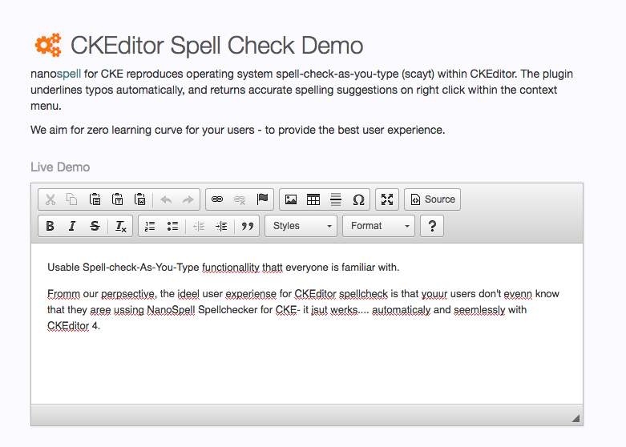

#CKEditor Spell Check Demo

This project contains examples and source code for the use of the  CKEditor spellchecking plug-in developed by http://nanospell.com 

##Hello World 

Our primary objective is to get a hello world and show how easy it is to install international spellchecking into your web application via CKEditor.

This is achieved by downloading and installing the  nano spell plug-in from http://ckeditor-spellcheck.nanospell.com/  and using JavaScript to initialise it alongside CKEditor.

The example in hello-world.html within this github project will work first time given that it is run  within a web server such as localhost, IIS or Apache.

##What is CKEditor?
    
CKEditor is a very popular website  plug-in   found in numerous  web applications, both custom and open source  with as many as 16 million installs.   It is incredibly useful for allowing non-technical users of web applications to create content that contains rich markup that styled text visually and features such as images links and tables.

##Why does CKEditor need a spellchecker?

CKEditor itself does not contain a spellchecker. In-fact it's use of contextual menus prohibit the use of native spellchecker which might find in the operating system and browser (which most users are familiar with using in our day-to-day use of the Internet).

CKEditor *doe*s have access to a free spellchecking service from spellchecker.net.   This is applicable and useful for many applications; however it comes with security caveats because information is sent for off site processing.  It also is paid for by advertising pop-ups which may seem nonprofessionals in commercial applications and certainly not approriate within intranet environments.

NanoSpell provide an entirely local spellchecking service for CKEditor through this plug-in.    All for your information stays on-site within your firewall or website environment alleviating securities concerns and all without a single advertising banner.

##Getting Started

###1 Download
The first step to installing your spellchecker for CKEditor to download the plug-in and copy it into the root of your web application. If you prefer a simpler way simply clone/download this github  repo.

###2 Check Everything Works
The next step is to make everything is working properly.    browse to the Nano spell folder in your browser using the HTTP protocol  (on your local postal Web server)  and browse to get-started.html   this will walk through the entire installation process debug any problems and provide customised code samples based on your own server environment is a one-stop shop and generally alleviates over 90% of getting started problems

###3 Hook it up

The final step is to copy and paste the code sample from get started.html into your webpages you CKEditor.

Generally this includes two script blocks 1 to include the **nanospell/include.js** file and the 2nd to configure the spellchecker.  

This tells CKEditor to use the spellchecker and allows you to set properties such as which dictionaries you wish to use and give it detailed information about your server environment to increase performance.

   
## Spellchecker Requirements

Th spellchecker plug-in for CKEditor can be installed almost anywhere you see HTML.   It *does* require a Web server such as Windows IIS or Apache (all platforms) ,  but it does not require any special languages plug-ins installers executables from the box.

In the backend it chooses from PHP, Asp.Net or VBScript to process spellchecking requests based on what your server has available without further installation support. Java is also supported although the installation process is more complicated.

##Installing

From the example you can already see that installing nanoscale spellchecking plug-in for CKEditor is incredibly straightforward. 

Simply download nano-spell from http://ckeditor-spellcheck.nanospell.com/downloads/nanospell.zip and then as a small JavaScript stopped your page to connect nanoscale to CKEditor the rest is automatic.

For advanced installation and configuration (which most users do not use) you can see detailed information at http://ckeditor-spellcheck.nanospell.com/how-to-install

##Features

####Usability
One of the things which we consistently hear from our user base is that nanospell spellchecking plug-in for CKEditor is seamless and intuitive: the users don't even know if there they simply assumed that the functionality was native we consider that zero learning curve and a perfect result.

####Install Anywhere by Copy & Pase

No need to run an installer, simply copy and paste the nanospell folder into your project.

Another  popular advantage of this plug-in is that it happily sits on UNIX, BSD, Solaris, OS X (Mac) and Windows servers (Pretty much anywhere).  

This means that enterprise customers can purchase a single solution to cover all of their enterprise spellchecking needs across both web and secure intranet platforms.   This includes used behind firewalls which is the predominant use case for this  plug-in.

####Sits in the Front End / Design layer

Web developers enjoy the fact that installation is in a familiar jquery like format performed in the front-end layer using JavaScript. Even hard-core back-end developers generally prefer to abstract UI components such as spellchecking into the HTML and JavaScript layer because it removes clutter from server logic which needs to be kept uncluttered.

##Ckeditor Spell-checking Dictionaries

This plugin benefits from dictionaries in over 23 languages these dictionaries can be customised with words added and removed by the developer using simple text files. Very useful for adding custom vocabulary proprietary to your business or organisation.

See teh full list at: http://ckeditor-spellcheck.nanospell.com/ckeditor-spellchecking-dictionaries

#### English Dictionaries

Free dictionaries include American, British, Canadian ,Australian & international English.  There are also free specialised English dictionaries for CKeditor for lawyers, scientists, engineers, doctors and other medical professionals.

#### International Dictionaries

We also have international support for Spanish French German Malay Finnish Swedish… The list goes on and we are open to creating new dictionaries for any language which users request given that they can provide a reasonable wordlist.

#### Vocabulary Control

One huge advantage of nanospell over native spellchecking is that the developer and system administrator can guarantee the availability of an appropriate dictionary. 

You don't need to guess what user system or install a dictionary locally everything sits on the server guaranteeing that the quality of input content to your website or intranet is of a high standard and does not frustrate users. 

##Licences             

To be clear the source code for hello-world.html within this repo is open source you may do whatever you wish.

The NanoSpell component (nanospell folder)   contains proprietary software and we appreciate your respecting that license so that we can continue to develop this project further.    Just as SQL Server is not free but tutorials on it are.... so the examples & demos are free yet the underlying technology is proprietary.

Either way the focus is on ease-of-use for the developer.  Even commercial models allow free development and paid licences are based on a deployment rather than a developer seat basis.

If unsure please read the EULA.   

##Support

This CKEditor spellchecker is actively developed. We are  generally available to talk to our users learn from them and absorb their ideas.   

If you find an issue or have an idea for a feature please do contact us either via our website http://ckeditor-spellcheck.nanospell.com/developer-support  or using the community involvement features such as the wiki and tracker within this getup repo.
          

